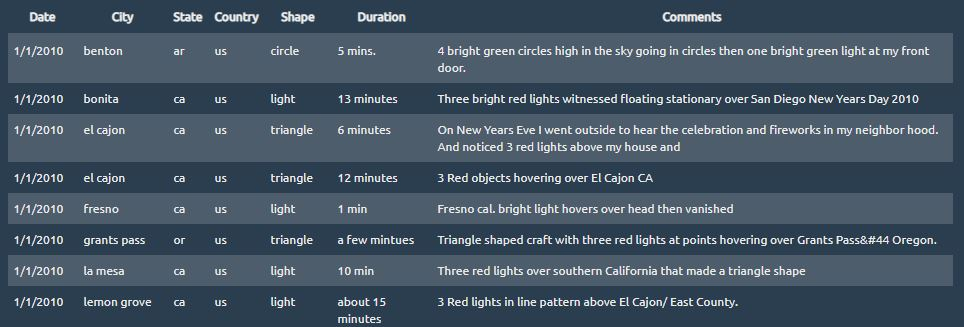
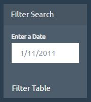

# JavaScript Project

## Searchable UFO Website

I created an interactive website based on a dataset of UFO sightings across the United States. The website allows users to filter table data based on the date of the UFO sighting.

I appended a table to the web page adding new rows of data for each UFO sighting.

Using Javascript, I wrote code that searches through the `Date` column to find rows that match user input.

We need you to write code that will create a table dynamically based upon a [dataset we provide](StarterCode/static/js/data.js). We also need to allow our users to filter the table data for specific values. There's a catch though... we only use pure JavaScript, HTML, and CSS, and D3.js on our web pages.

* Create a basic HTML web page or use the [index.html](StarterCode/index.html) file provided (we recommend building your own custom page!).

* Using the UFO dataset provided in the form of an array of JavaScript objects, 

  * Make sure you have a column for `date/time`, `city`, `state`, `country`, `shape`, and `comment` at the very least.

* Use a date form in your HTML document and write JavaScript code that will listen for events and search through the `date/time` column to find rows that match user input.

### Level 2: Multiple Search Categories (Optional)

* Complete all of Level 1 criteria.

* Using multiple `input` tags and/or select dropdowns, write JavaScript code so the user can to set multiple filters and search for UFO sightings using the following criteria based on the table columns:

  1. `date/time`
  2. `city`
  3. `state`
  4. `country`
  5. `shape`

- - -

### Dataset

* [UFO Sightings Data](StarterCode/static/js/data.js)

- - -

**Good luck!**

- - -

### Copyright

Trilogy Education Services © 2019. All Rights Reserved.
